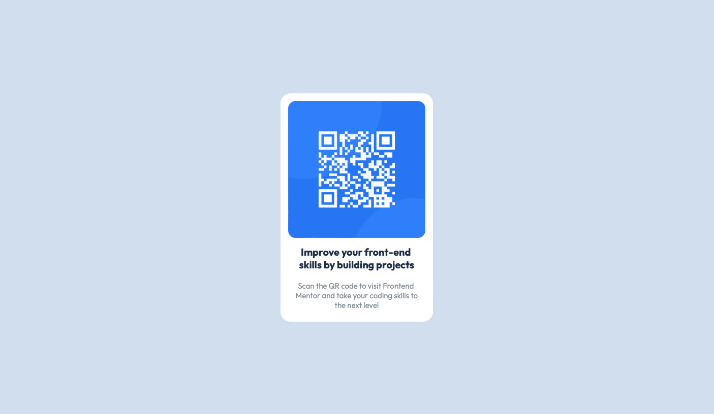

# Frontend Mentor - QR code component solution

This is a solution to the [QR code component challenge on Frontend Mentor](https://www.frontendmentor.io/challenges/qr-code-component-iux_sIO_H). Frontend Mentor challenges help you improve your coding skills by building realistic projects. 

## Overview

### Screenshot

### Links

- [Solution on GitHub Pages](https://your-solution-url.com)

## My process

### Built with

- CSS custom properties
- Flexbox
- Mobile-first workflow